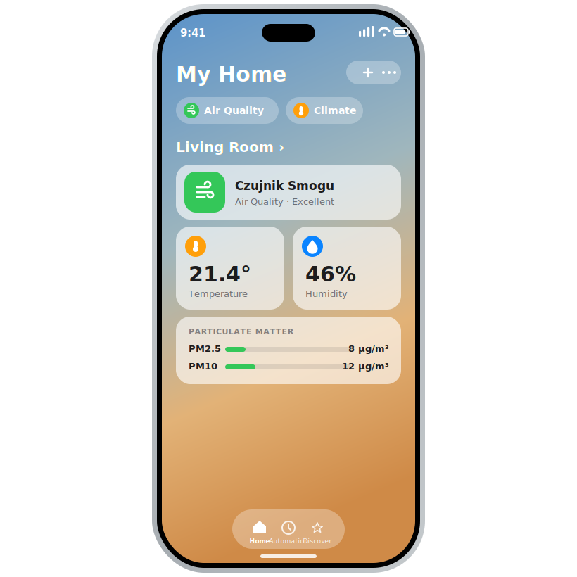

# homebridge-luftdaten

Bring your [Luftdaten / Sensor.Community](https://sensor.community/) air-quality
sensor into Apple HomeKit — local-first, with an automatic cloud fallback.

[](https://github.com/rafalr100/homebridge-luftdaten/actions/workflows/build.yml)
[](https://www.npmjs.com/package/homebridge-luftdaten)
[](https://www.npmjs.com/package/homebridge-luftdaten)
[](LICENSE)




---

A Homebridge **dynamic platform** plugin that exposes one or more Luftdaten /
Sensor.Community sensors (airrohr firmware — typically an **SDS011** particulate
sensor plus an **SHT3X** or **BME280** temperature/humidity sensor) to Apple
HomeKit.

It reads **locally first** from the sensor's own `data.json` endpoint and
**falls back to the Sensor.Community cloud** when the local device is
unreachable. Zero external dependencies — it uses the built-in `fetch` (Node 18+)
and `AbortController` for timeouts.

## Features

- 🏠 Local-first reading (`http://<ip>/data.json`), cloud fallback via the
  Sensor.Community API.
- 🌫️ Air quality (1–5) derived from PM2.5 using WHO/EU thresholds, plus raw
  PM2.5 and PM10 density.
- 🌡️ Temperature and humidity (optional, on by default).
- 🧩 Dynamic platform — add as many sensors as you like under one config block.
- 🔄 Configurable polling interval and request timeout.
- 🚦 Surfaces "No Response" in HomeKit when the sensor can't be reached.
- 📦 No runtime dependencies.

## Why this plugin?

- **Local-first, not cloud-only.** Reads the sensor's own `data.json` on your LAN
  and only falls back to the Sensor.Community cloud when the device is
  unreachable — fast, private, and resilient.
- **One plugin for the whole device.** Air quality *and* temperature/humidity
  from a single airrohr sensor, across all firmware `value_type` variants.
- **Honest offline state.** When the sensor can't be read, HomeKit shows
  "No Response" instead of stale numbers.
- **Lightweight.** Zero runtime dependencies — just the built-in `fetch`.
- **Multiple sensors** under one platform block, with a click-to-configure UI.

## Exposed HomeKit services & characteristics

| Service | Characteristic | Source | Notes |
|---|---|---|---|
| AirQualitySensor | `AirQuality` (1–5) | derived from PM2.5 | see thresholds below |
| AirQualitySensor | `PM2_5Density` | `SDS_P2` / `P2` | µg/m³ |
| AirQualitySensor | `PM10Density` | `SDS_P1` / `P1` | µg/m³ |
| TemperatureSensor | `CurrentTemperature` | `*_temperature` | name `"<name> Temp"`, range −50…100 °C |
| HumiditySensor | `CurrentRelativeHumidity` | `*_humidity` | name `"<name> Humidity"` |
| AccessoryInformation | `Manufacturer` | — | `Sensor.Community` |
| AccessoryInformation | `Model` | — | `SDS011 + SHT3X/BME280` |
| AccessoryInformation | `SerialNumber` | — | `sensorId` (or `localUrl`) |

Temperature and humidity services are only added when `hasTempSensor` is `true`
(the default).

Atmospheric **pressure** (`BME280_pressure` / `BMP280_pressure`, converted Pa → hPa)
is parsed and written to the Homebridge log, but **not** exposed to HomeKit —
there is no native HomeKit characteristic for barometric pressure.

### value_type variants understood by the parser

- PM: `SDS_P1` → PM10, `SDS_P2` → PM2.5 (local); `P1` → PM10, `P2` → PM2.5 (cloud API)
- Temperature: `SHT3X_temperature`, `BME280_temperature`, `BMP280_temperature`,
  `DHT_temperature`, generic `temperature`
- Humidity: `SHT3X_humidity`, `BME280_humidity`, `DHT_humidity`, generic `humidity`
- Pressure: `BME280_pressure`, `BMP280_pressure` (÷100 → hPa)

## Supported hardware

Any [Sensor.Community](https://sensor.community/) / Luftdaten station running the
**airrohr** firmware that serves a `data.json` endpoint and/or publishes to the
Sensor.Community cloud:

| Component | Role | Notes |
|---|---|---|
| **SDS011** (Nova Fitness) | PM2.5 / PM10 | the particulate sensor |
| **SHT3X** | temperature + humidity | |
| **BME280** | temperature + humidity + pressure | pressure logged only |
| **BMP280** | temperature + pressure | no humidity |
| **DHT22 / DHT11** | temperature + humidity | generic `DHT_*` variants |

Set `hasTempSensor: false` for an SDS011-only station. Pressure is read and
logged but not exposed to HomeKit (no native characteristic exists).

## PM2.5 → AirQuality mapping (µg/m³)

| PM2.5 | AirQuality |
|---|---|
| ≤ 10 | 1 — EXCELLENT |
| ≤ 20 | 2 — GOOD |
| ≤ 25 | 3 — FAIR |
| ≤ 50 | 4 — INFERIOR |
| > 50 | 5 — POOR |
| missing / NaN | 0 — UNKNOWN |

## Installation

There are two ways to install the plugin.

### Option A — from npm / Homebridge UI (recommended)

The easy route. In the **Homebridge UI** open the **Plugins** tab, search for
`luftdaten`, and click **Install**. Then click **Settings** (⚙️) and fill in the
form — no manual JSON editing needed. Updates appear automatically in the UI.

Or from the command line:

```bash
npm install -g homebridge-luftdaten
```

### Option B — from GitHub (manual)

Installs the latest `main` straight from this repository. Requires `git` on the
host. Run it with sufficient privileges (or as root):

```bash
hb-service add https://github.com/rafalr100/homebridge-luftdaten
# no git on the host? install from the tarball instead:
# hb-service add https://github.com/rafalr100/homebridge-luftdaten/archive/refs/heads/main.tar.gz
```

With this route the Homebridge UI **won't** show update notifications — to update,
re-run the same command. Configuration works the same as Option A (the Settings
form still appears), or you can edit `config.json` by hand (see below).

A full, step-by-step walkthrough is in **[INSTALL.md](INSTALL.md)**.

## Configuration

Configure it from the **Settings** form in the Homebridge UI, or add a platform
block to your `config.json` manually. Add one entry per sensor to the `sensors`
array:

```json
{
  "platforms": [
    {
      "platform": "Luftdaten",
      "name": "Luftdaten",
      "sensors": [
        {
          "name": "Living Room Air",
          "localUrl": "http://192.168.1.50/data.json",
          "sensorId": "12345",
          "pollInterval": 120,
          "requestTimeout": 10,
          "hasTempSensor": true
        }
      ]
    }
  ]
}
```

| Option | Type | Default | Description |
|---|---|---|---|
| `platform` | string | — | Must be `"Luftdaten"`. |
| `name` | string | `"Luftdaten"` | Platform name (shown in the logs). |
| `sensors[].name` | string | `"Luftdaten"` | Name shown in the Home app. |
| `sensors[].localUrl` | string | — | Local sensor endpoint, e.g. `http://192.168.1.50/data.json`. Tried first. |
| `sensors[].sensorId` | string/number | — | Sensor.Community sensor ID, used for the cloud fallback. |
| `sensors[].pollInterval` | number | `120` | Seconds between reads (min 10). |
| `sensors[].requestTimeout` | number | `10` | Per-request timeout in seconds (min 1). |
| `sensors[].hasTempSensor` | boolean | `true` | Add temperature + humidity services. |
| `sensors[].hasBME280` | boolean | — | **Deprecated** alias for `hasTempSensor`, kept for backward compatibility. |

Each sensor needs at least one of `localUrl` or `sensorId`. If both are present,
the local URL is used and the cloud is only contacted when the local read fails.

> **Upgrading from v1.x?** v2 is a **dynamic platform**. Move your old `accessories`
> entry into a `platforms` block as shown above (wrap your settings in a `sensors`
> array, and change `"accessory": "Luftdaten"` to `"platform": "Luftdaten"`).

## How it works

```
        ┌──────────────────────────┐
poll →  │  GET localUrl (priority)  │ ── ok ──►  parse  ─┐
        └──────────────────────────┘                    │
                     │ fail/timeout                      ▼
                     ▼                          update HomeKit
        ┌──────────────────────────┐           characteristics
        │ GET cloud API (fallback) │ ── ok ──►  parse  ─┘
        │  …/v1/sensor/<id>/       │
        └──────────────────────────┘
```

## Changelog

See [CHANGELOG.md](CHANGELOG.md) for the version history.

## Development

```bash
npm run check   # node --check src/index.js
npm test        # node --test
```

## License

[MIT](LICENSE) © Rafał Rudecki
